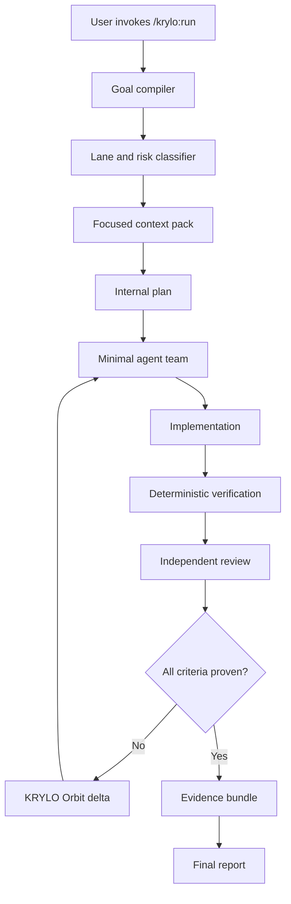
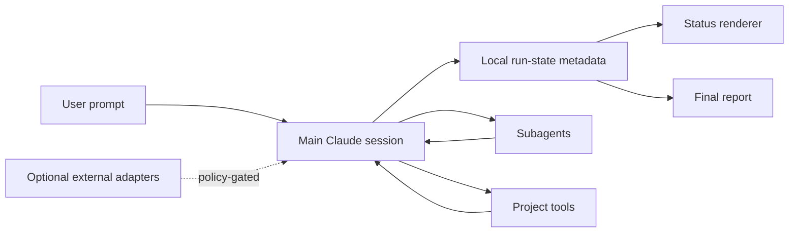

# KRYLO Architecture

## Architectural style

KRYLO is a thin orchestration plugin with a Markdown control plane and a small deterministic Node.js runtime. Language models perform interpretation, planning, implementation, and review. Scripts perform state management, policy enforcement, validation, redaction, status rendering, and bounded-loop decisions.

## High-level flow



## Component boundaries

### Shared Core, Claude Host, and Codex Host

KRYLO has one Shared Core and thin host-specific adapters (`docs/adr/0023-multi-host-product-and-shared-core.md`).

Shared Core owns:

- Run state, Orbit, evidence, completion, approvals, tool governance, data-egress policy, telemetry/privacy, external-adapter policy, and logical agent roles.
- The host-neutral `HostIdentity` and `HostContext` contracts: host name, host session identifier, optional host turn identifier, and project/plugin/data roots. Every host adapter normalizes its own inputs into this shape before calling Shared Core; Shared Core never reads a host-specific environment variable or Hook payload field directly.
- The KRYLO-owned `runId`: the persisted run identity referenced by state, delegation, evidence, and approvals. A host session identifier is metadata attached to a run, not the run identity itself.

Host adapters own invocation syntax, host-specific Hook input/output translation (the Hook transport), host session metadata, host agent configuration, model mapping, packaging, and setup mechanics.

- **Claude Host** (implemented and released): the public Claude Code plugin described below.
- **Codex Host** (implemented, not yet released): a real Codex CLI plugin package (`plugins/krylo/.codex-plugin/plugin.json`), an explicit-only `krylo-run` Skill, and a Codex-specific Hook transport (`scripts/host/codex/`) built on the same Shared Core, per `docs/adr/0029-codex-host-packaging-and-approval-boundary.md` and `docs/process/CODEX_HOST_IMPLEMENTATION_PLAN.md`. Because current official Codex `PreToolUse` output does not support the native `ask` decision Claude uses (ADR-0027), a `require-approval` classification denies deterministically on Codex instead of prompting -- see `docs/codex-capability-matrix.md` for the full, host-by-host capability comparison and every documented fallback. Full VS Code (project-scoped hook) enforcement setup remains a disclosed follow-up, not yet implemented.

### Plugin interface

Owns:

- Skills and command behavior.
- Agent definitions.
- Hooks and monitors.
- User configuration schema.
- Optional status-line integration.
- Marketplace metadata.

Does not own:

- The user's source repository.
- Production credentials.
- External service accounts.
- Third-party plugin lifecycle.

### Runtime core (Shared Core)

Owns:

- Run state.
- Checkpoints.
- Orbit counters.
- Failure fingerprints.
- Risk and question tokens.
- Evidence metadata.
- Local telemetry aggregation.
- Redaction and retention.

Runtime state must be written under a KRYLO-owned, host-provided persistent data root that the active host adapter resolves (`${CLAUDE_PLUGIN_DATA}` on the Claude Host), never inside the plugin/installation root and never in the application repository by default.

### Repository instruction boundary

The root `CLAUDE.md` is a compact repository operating index capped at 130 lines. It points to authoritative product, architecture, security, workflow, and release documents through progressive references. It governs contributors and Claude Code while modifying the KRYLO source repository, is not installed into user projects, and is not an end-user runtime policy file.

### Markdown control plane

Owns:

- Operating principles.
- Lane policy.
- Risk policy.
- Agent prompts.
- Completion contract.
- Tool-governance policy.
- Final-report format.

It must remain concise enough to avoid unnecessary context cost. Detailed policies are split into references loaded only when needed.

### External adapters

Adapters are detection and policy modules, not required dependencies. They describe how KRYLO may use a tool when it is already installed, authenticated, relevant, and allowed by the active security profile.

## Public repository layout

```text
krylo/
|-- .claude-plugin/
|   `-- marketplace.json
|-- CLAUDE.md
|-- plugins/
|   `-- krylo/
|       |-- .claude-plugin/plugin.json
|       |-- skills/
|       |-- agents/
|       |-- hooks/hooks.json
|       |-- monitors/monitors.json          # optional and experimental
|       |-- scripts/
|       |-- references/
|       |-- schemas/
|       |-- adapters/
|       |-- catalog/
|       |-- policies/
|       |-- tests/
|       |-- evals/
|       |-- settings.json                   # subagentStatusLine only if used
|       |-- README.md
|       `-- LICENSE
|-- docs/
|-- .github/workflows/
|-- README.md
|-- SECURITY.md
|-- THREAT_MODEL.md
|-- CONTRIBUTING.md
|-- CHANGELOG.md
`-- LICENSE
```

## Data flow



The raw user prompt remains in the Claude conversation and is not copied into KRYLO telemetry. Persisted metadata contains only a short normalized goal, identifiers, statuses, counts, hashes, and evidence references.

## Trust boundaries

1. Claude conversation context.
2. Application repository.
3. Local plugin runtime data.
4. External tools and MCP servers.
5. Production systems.
6. Public marketplace and supply chain.

Each boundary has separate controls described in `SECURITY.md`, `THREAT_MODEL.md`, and `docs/09-tool-governance.md`.
