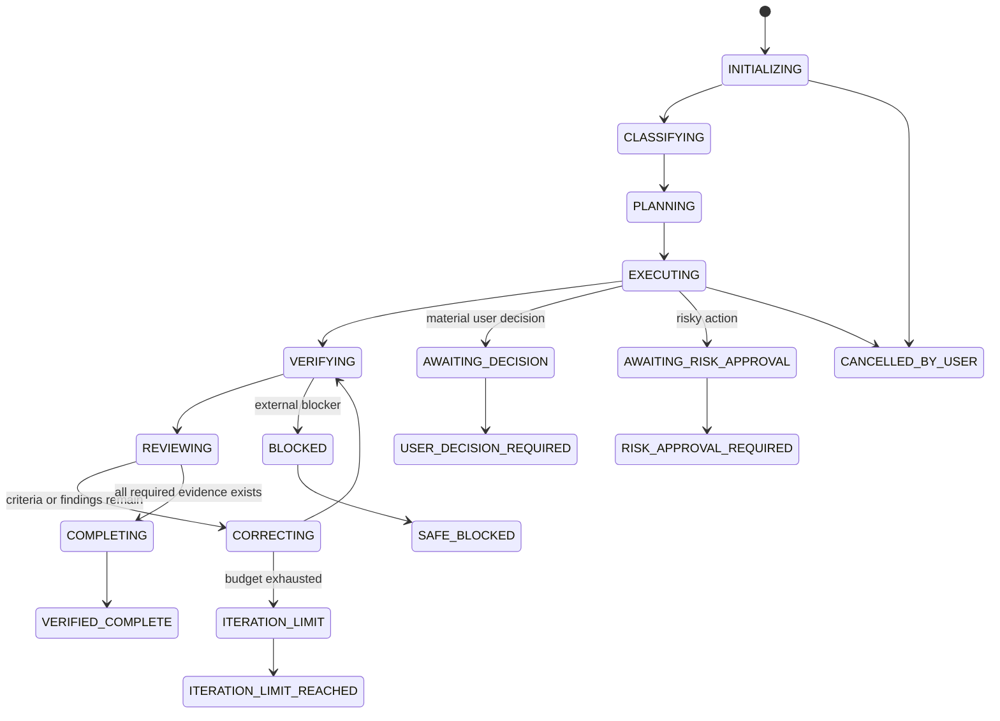

# Runtime State Machine

## States

## Run-state ownership

The deterministic runtime owns state transitions. The model proposes actions and reports evidence, but may not directly mark a run complete without satisfying the completion gate.

## Required run-state fields

- Schema version (currently `1.1.0`).
- KRYLO version.
- Host identity: host name, host session identifier, and optional host turn identifier.
- Delegation: whether the run is an external-worker delegation, its depth, and an optional parent run identifier.
- KRYLO-owned run identifier, independent of the host session identifier.
- Project root hash and repository metadata.
- Lane, risk, and complexity.
- Normalized goal.
- Acceptance criteria.
- Constraints and non-goals.
- Selected agents and configured models.
- Resolved models when available.
- Tool counters.
- Orbit budget and current cycle.
- Failure fingerprints.
- Findings and criterion status.
- Evidence references.
- Terminal state.
- Timestamps.

## Schema versioning and migration

Schema `1.1.0` introduced host-neutral identity. It replaced the prior flat `sessionId` field with a `host` object (`name`, `sessionId`, optional `turnId`) and added a `delegation` object (`externalWorker`, `depth`, optional `parentRunId`). Migration from schema `1.0.0` is deterministic and one-directional: the legacy `sessionId` becomes `host.sessionId` with `host.name` set to `claude` (the only host that produced `1.0.0` state), and `delegation` defaults to a non-delegated, depth-0 run. A document with any other prior schema version, or a `1.0.0` document missing `sessionId`, is refused rather than guessed. Refused or corrupted state is preserved for diagnosis, and a fresh recovery state is initialized instead of trusting it.

## Persistence

State is stored under a KRYLO-owned data root resolved by the active host adapter (`${CLAUDE_PLUGIN_DATA}` on the Claude Host) using atomic writes:

1. Write a temporary file.
2. Flush when supported.
3. Rename over the prior state.
4. Validate against the schema.

Corrupted state must not be trusted. KRYLO should preserve the corrupted file for diagnosis, initialize a safe recovery state, and report the problem.

## Resumption

A resumed run must verify:

- The project root is unchanged.
- The current repository is compatible with the saved run.
- The current HEAD and working tree have not diverged in a way that invalidates the plan.
- Background agents are not assumed active after process restart.
- Evidence from prior commands is marked stale when the repository changed.
