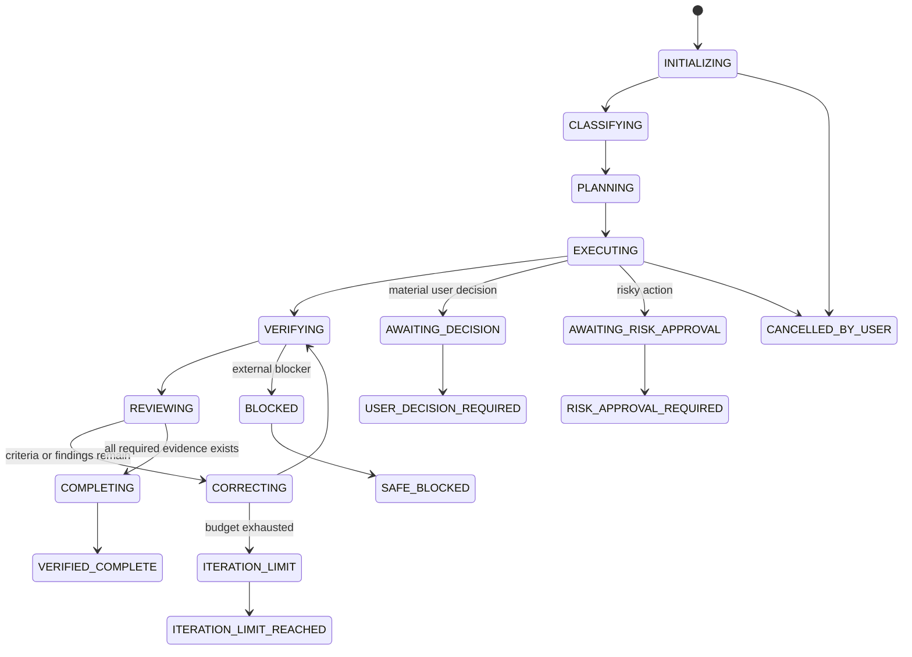

# Runtime State Machine

## States

## Run-state ownership

The deterministic runtime owns state transitions. The model proposes actions and reports evidence, but may not directly mark a run complete without satisfying the completion gate.

## Required run-state fields

- Schema version.
- KRYLO version.
- Session and run identifiers.
- Project root hash and repository metadata.
- Lane, risk, and complexity.
- Normalized goal.
- Acceptance criteria.
- Constraints and non-goals.
- Selected agents and configured models.
- Resolved models when available.
- Tool counters.
- Orbit budget and current cycle.
- Failure fingerprints.
- Findings and criterion status.
- Evidence references.
- Terminal state.
- Timestamps.

## Persistence

State is stored under `${CLAUDE_PLUGIN_DATA}` using atomic writes:

1. Write a temporary file.
2. Flush when supported.
3. Rename over the prior state.
4. Validate against the schema.

Corrupted state must not be trusted. KRYLO should preserve the corrupted file for diagnosis, initialize a safe recovery state, and report the problem.

## Resumption

A resumed run must verify:

- The project root is unchanged.
- The current repository is compatible with the saved run.
- The current HEAD and working tree have not diverged in a way that invalidates the plan.
- Background agents are not assumed active after process restart.
- Evidence from prior commands is marked stale when the repository changed.
